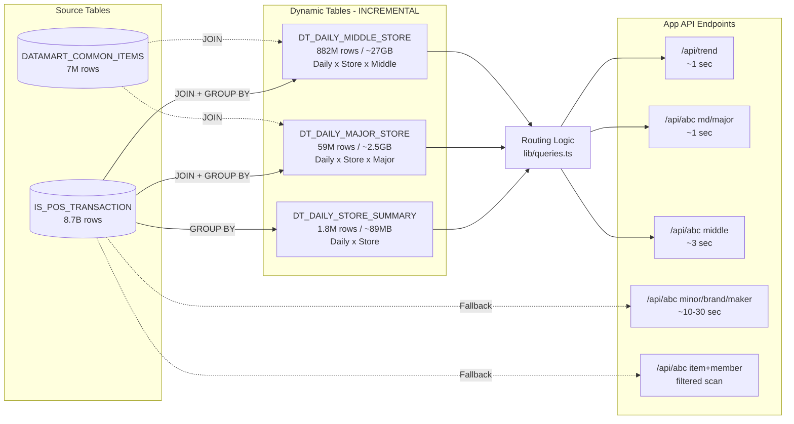

# DataCompass Pro - データサマリ

## 概要

本ドキュメントは DataCompass Pro で使用している Snowflake テーブル群のデータ概要をまとめたものです。

- **データベース**: `PPIH_FULL_DB`
- **データ期間**: 2024-07-01 〜 2026-06-30 (2年間 / 730日)
- **対象店舗数**: 842店舗
- **対象会員数**: 2,000万人
- **対象商品数**: 700万SKU

---

## 1. IS_POS_TRANSACTION (POSトランザクション)

| 項目 | 値 |
|------|------|
| スキーマ | `PPIH_FULL_DB.ANALYTICS` |
| 件数 | **8,693,965,660 (約87億行)** |
| 期間 | 2024-07-01 〜 2026-06-30 |
| 日数 | 730日 |
| 店舗数 | 842 |
| 商品数 | 7,000,000 |
| レシート数 | 約87億 (1行 = 1明細行) |
| 会員数 (近似) | 約496万 |
| 売上合計 (売上区分のみ) | 約29.6兆円 |
| 売上数量合計 | 約120億個 |
| 平均単価 | 2,473円 |
| 1日あたり平均売上 | 約406億円 |

### カラム構成

| カラム | 型 | 説明 |
|--------|------|------|
| BUSINESS_DATE | DATE | 営業日 |
| STORE_CODE | VARCHAR | 店舗コード |
| TRADE_KEY | VARCHAR | レシートキー (1取引1キー) |
| MAJICA_NO | VARCHAR | 会員番号 (NULL = 非会員) |
| ITEM_CODE | VARCHAR | JANコード |
| ITEM_SALES_QUANTITY | NUMBER | 売上数量 |
| ITEM_SALES_AMOUNT | NUMBER | 売上金額 |
| TRADE_CLASS_3 | VARCHAR | 取引区分 |

### 取引区分別 レコード分布

| 取引区分 | 件数 | 割合 |
|----------|------|------|
| 売上 | 8,259,256,017 | 95.00% |
| 返品 | 426,016,703 | 4.90% |
| 値引 | 8,692,940 | 0.10% |

### 大分類別 レコード分布

| 大分類 | 件数 | 割合 |
|--------|------|------|
| ホームエレクトロニクス | 1,857,126,877 | 21.36% |
| ステーショナリー | 429,340,784 | 4.94% |
| トイ＆バラエティ | 428,538,723 | 4.93% |
| フード＆ドリンク | 389,362,423 | 4.48% |
| スキンケア | 382,647,220 | 4.40% |
| インポート | 289,761,036 | 3.33% |
| 理美容家電 | 279,392,360 | 3.21% |
| カーライフ | 270,521,633 | 3.11% |
| 寝具 | 265,301,819 | 3.05% |
| サイクル | 236,999,617 | 2.73% |
| シューズ | 233,113,674 | 2.68% |
| ホームグッズ | 223,583,315 | 2.57% |
| デイリーグッズ | 223,538,754 | 2.57% |
| ラブグッズ | 222,445,196 | 2.56% |
| ヘルスケア | 220,490,144 | 2.54% |
| ファッション＆カバン | 213,212,088 | 2.45% |
| スマホパーツ | 200,151,516 | 2.30% |
| ブランドファッション | 188,455,890 | 2.17% |
| コスメ | 178,229,493 | 2.05% |
| アウトドア | 174,541,143 | 2.01% |
| ペット＆ガーデン | 171,035,825 | 1.97% |
| パーティーグッズ | 156,886,652 | 1.80% |
| リカー＆ワイン | 139,182,119 | 1.60% |
| CBD | 134,691,336 | 1.55% |
| 医薬品 | 132,215,856 | 1.52% |
| レディス・キッズインナー | 130,493,151 | 1.50% |
| レディスファッション雑貨 | 126,618,094 | 1.46% |
| デイリー | 96,297,292 | 1.11% |
| プロテイン・トレーニング | 86,359,206 | 0.99% |
| メンズインナー | 81,333,071 | 0.94% |
| フレッシュミート | 71,712,705 | 0.82% |
| ギフト | 59,030,819 | 0.68% |
| アロマ | 51,137,550 | 0.59% |
| UNY用レディース | 46,903,954 | 0.54% |
| UNY用靴 | 46,171,948 | 0.53% |
| UNY用メンズ | 37,356,450 | 0.43% |
| UNY用子供ベビー | 37,226,285 | 0.43% |
| UNY用インナー | 37,080,090 | 0.43% |
| デリカ | 34,934,291 | 0.40% |
| ベジタブル・フルーツ | 32,505,046 | 0.37% |
| フレッシュフィッシュ | 30,435,272 | 0.35% |
| フューチャープロダクト | 28,301,666 | 0.33% |
| 菓子・珍味 | 19,303,277 | 0.22% |

---

## 2. DATAMART_COMMON_ITEMS (商品マスタ)

| 項目 | 値 |
|------|------|
| スキーマ | `PPIH_FULL_DB.MASTER` |
| 件数 | **7,000,000行** |
| 区分カラム | `ITEM_CATEGORY_CLASS` (DS / UNY) |

### カテゴリ区分別 概要

| 区分 | 説明 | 商品数 | 割合 | 大分類 | 中分類 | 小分類 | ブランド | メーカー |
|------|------|---:|---:|---:|---:|---:|---:|---:|
| DS | ドン・キホーテ (ディスカウント) | 4,300,000 | 61.4% | 35 | 638 | 8,279 | 5,000 | 1,500 |
| UNY | ユニー (GMS/食品スーパー) | 2,700,000 | 38.6% | 43 | 539 | 7,000 | 5,000 | 1,500 |
| **合計** | | **7,000,000** | **100%** | **43** | **984** | **12,770** | **10,000** | **1,500** |

### 分類体系とユニーク数 (全体)

| 分類レベル | ユニーク数 |
|------------|---:|
| MD (事業部) | 7 |
| 大分類 (MAJOR) | 43 |
| 中分類 (MIDDLE) | 984 |
| 小分類 (MINOR) | 12,770 |
| ブランド (BRAND) | 10,000 |
| メーカー (MAKER) | 1,500 |
| 商品 (ITEM_CODE) | 7,000,000 |

### MD (事業部) 別の階層内訳 — DS (ディスカウント)

| MD | 大分類数 | 中分類数 | 小分類数 | 商品数 |
|----|---:|---:|---:|---:|
| ホーム＆レジャー | 14 | 249 | 3,237 | 1,697,124 |
| ファッション | 6 | 129 | 1,677 | 848,562 |
| コスメ | 5 | 94 | 1,212 | 613,272 |
| フード＆ドリンク | 4 | 81 | 1,048 | 529,340 |
| デイリーグッズ | 3 | 64 | 832 | 420,992 |
| ホームエレクトロニクス | 2 | 27 | 351 | 177,606 |
| フレッシュミート | 1 | 2 | 26 | 13,104 |

### MD (事業部) 別の階層内訳 — UNY (ユニー)

| MD | 大分類数 | 中分類数 | 小分類数 | 商品数 |
|----|---:|---:|---:|---:|
| ホーム＆レジャー | 14 | 182 | 2,366 | 913,276 |
| ファッション | 11 | 130 | 1,690 | 652,340 |
| コスメ | 5 | 82 | 1,066 | 411,476 |
| フード＆ドリンク | 4 | 50 | 650 | 249,848 |
| デイリーグッズ | 3 | 40 | 520 | 200,720 |
| フレッシュミート | 4 | 37 | 474 | 182,016 |
| ホームエレクトロニクス | 2 | 18 | 234 | 90,324 |

### 主要カラム

| カラム | 説明 |
|--------|------|
| ITEM_CODE | JANコード (PK) |
| ITEM_NAME | 商品名 |
| ITEM_CATEGORY_CLASS | カテゴリ区分 (DS / UNY) |
| MD_CODE / MD_NAME | 事業部 |
| MAJOR_CODE / MAJOR_NAME | 大分類 |
| MIDDLE_CODE / MIDDLE_NAME | 中分類 |
| MINOR_CODE / MINOR_NAME | 小分類 |
| BRAND_CODE / BRAND_NAME | ブランド |
| MAKER_CODE / MAKER_NAME | メーカー |

---

## 3. DATAMART_COMMON_STORES (店舗マスタ)

| 項目 | 値 |
|------|------|
| スキーマ | `PPIH_FULL_DB.MASTER` |
| 件数 | **842行** |
| 業態数 | 6 |
| 都道府県数 | 47 |
| 法人数 | 2 |
| エリア数 | 8 |

### 業態別 店舗数

| 業態 | 店舗数 |
|------|---:|
| ディスカウントストア | 387 |
| MEGAドン・キホーテ | 221 |
| アピタ(GMS) | 119 |
| ピアゴ(食品スーパー) | 98 |
| ピカソ(小型店) | 12 |
| ユニー(GMS) | 5 |

### 主要カラム

| カラム | 説明 |
|--------|------|
| STORE_CODE | 店舗コード (PK) |
| STORE_NAME | 店舗名 |
| CORPORATION_CODE / NAME | 法人 |
| BUSINESS_TYPE_CODE / NAME | 業態 |
| AREA_CODE / NAME | エリア |
| PREFECTURE_CODE / NAME | 都道府県 |
| OPENING_DATE | 開店日 |
| CLOSING_DATE | 閉店日 |

---

## 4. DATAMART_COMMON_MEMBERS (会員マスタ)

| 項目 | 値 |
|------|------|
| スキーマ | `PPIH_FULL_DB.MASTER` |
| 件数 | **20,000,000行 (2,000万人)** |
| 性別区分 | 2 |
| 年代区分 | 7 |
| 会員ランク区分 | 6 |

### 性別分布

| 性別 | 人数 | 割合 |
|------|---:|---:|
| 男性 | 10,001,219 | 50.0% |
| 女性 | 9,998,781 | 50.0% |

### 年代分布

| 年代 | 人数 | 割合 |
|------|---:|---:|
| 70代以上 | 5,683,972 | 28.4% |
| 50代 | 2,780,893 | 13.9% |
| 30代 | 2,779,826 | 13.9% |
| 40代 | 2,779,740 | 13.9% |
| 20代 | 2,777,782 | 13.9% |
| 60代 | 2,776,478 | 13.9% |
| 10代 | 421,309 | 2.1% |

### 会員ランク分布

| ランク | 人数 | 割合 |
|--------|---:|---:|
| 一般 | 7,601,335 | 38.0% |
| ビギナー | 5,999,575 | 30.0% |
| ブロンズ | 2,999,239 | 15.0% |
| シルバー | 2,000,856 | 10.0% |
| ゴールド | 998,683 | 5.0% |
| プラチナ | 400,312 | 2.0% |

---

## 5. Dynamic Tables (事前集計テーブル)

ABC分析およびトレンド表示の高速化のために、ファクトテーブルを階層別に事前集計した Dynamic Table を運用しています。全て `REFRESH_MODE = INCREMENTAL` で1時間ごとに増分更新されます。

### アーキテクチャ図



### 一覧

| DT名 | 件数 | サイズ | 期間 | 集計粒度 |
|-------|---:|---:|---|---|
| DT_DAILY_STORE_SUMMARY | 1,843,980 | ~89MB | 2024-07-01〜2026-06-30 | 日次 x 店舗 x 取引区分 |
| DT_DAILY_MAJOR_STORE | 58,648,067 | ~2.5GB | 同上 | 日次 x 店舗 x 取引区分 x MD x 大分類 |
| DT_DAILY_MIDDLE_STORE | 882,462,116 | ~27GB | 同上 | 日次 x 店舗 x 取引区分 x MD x 大分類 x 中分類 |
| DT_MEMBER_DAILY_PURCHASE | 4,691,209,092 | ~163GB | 同上 | 会員 x 日次 x 店舗 |

### DT_DAILY_STORE_SUMMARY

```sql
CREATE DYNAMIC TABLE PPIH_FULL_DB.ANALYTICS.DT_DAILY_STORE_SUMMARY
  TARGET_LAG = '1 hour'
  REFRESH_MODE = INCREMENTAL
  WAREHOUSE = PPIH_WH_XL
AS
SELECT
  t.BUSINESS_DATE,
  t.STORE_CODE,
  t.TRADE_CLASS_3,
  SUM(t.ITEM_SALES_AMOUNT) AS TOTAL_SALES_AMOUNT,
  SUM(t.ITEM_SALES_QUANTITY) AS TOTAL_SALES_QUANTITY,
  COUNT(DISTINCT t.TRADE_KEY) AS RECEIPT_COUNT,
  COUNT(DISTINCT t.MAJICA_NO) AS MEMBER_COUNT
FROM PPIH_FULL_DB.ANALYTICS.IS_POS_TRANSACTION t
GROUP BY t.BUSINESS_DATE, t.STORE_CODE, t.TRADE_CLASS_3;
```

**用途**: trend API、店舗軸ABC分析

### DT_DAILY_MAJOR_STORE

```sql
CREATE DYNAMIC TABLE PPIH_FULL_DB.ANALYTICS.DT_DAILY_MAJOR_STORE
  TARGET_LAG = '1 hour'
  REFRESH_MODE = INCREMENTAL
  WAREHOUSE = PPIH_WH_XL
AS
SELECT
  t.BUSINESS_DATE,
  t.STORE_CODE,
  t.TRADE_CLASS_3,
  i.MD_CODE, i.MD_NAME,
  i.MAJOR_CODE, i.MAJOR_NAME,
  SUM(t.ITEM_SALES_AMOUNT) AS TOTAL_SALES_AMOUNT,
  SUM(t.ITEM_SALES_QUANTITY) AS TOTAL_SALES_QUANTITY,
  COUNT(DISTINCT t.TRADE_KEY) AS RECEIPT_COUNT,
  COUNT(DISTINCT t.MAJICA_NO) AS MEMBER_COUNT
FROM PPIH_FULL_DB.ANALYTICS.IS_POS_TRANSACTION t
JOIN PPIH_FULL_DB.MASTER.DATAMART_COMMON_ITEMS i ON i.ITEM_CODE = t.ITEM_CODE
GROUP BY t.BUSINESS_DATE, t.STORE_CODE, t.TRADE_CLASS_3,
         i.MD_CODE, i.MD_NAME, i.MAJOR_CODE, i.MAJOR_NAME;
```

**用途**: MD/大分類軸ABC分析 (~1秒レスポンス)

### DT_DAILY_MIDDLE_STORE

```sql
CREATE DYNAMIC TABLE PPIH_FULL_DB.ANALYTICS.DT_DAILY_MIDDLE_STORE
  TARGET_LAG = '1 hour'
  REFRESH_MODE = INCREMENTAL
  WAREHOUSE = PPIH_WH_XL
AS
SELECT
  t.BUSINESS_DATE,
  t.STORE_CODE,
  t.TRADE_CLASS_3,
  i.MD_CODE, i.MD_NAME,
  i.MAJOR_CODE, i.MAJOR_NAME,
  i.MIDDLE_CODE, i.MIDDLE_NAME,
  SUM(t.ITEM_SALES_AMOUNT) AS TOTAL_SALES_AMOUNT,
  SUM(t.ITEM_SALES_QUANTITY) AS TOTAL_SALES_QUANTITY,
  COUNT(DISTINCT t.TRADE_KEY) AS RECEIPT_COUNT,
  COUNT(DISTINCT t.MAJICA_NO) AS MEMBER_COUNT
FROM PPIH_FULL_DB.ANALYTICS.IS_POS_TRANSACTION t
JOIN PPIH_FULL_DB.MASTER.DATAMART_COMMON_ITEMS i ON i.ITEM_CODE = t.ITEM_CODE
GROUP BY t.BUSINESS_DATE, t.STORE_CODE, t.TRADE_CLASS_3,
         i.MD_CODE, i.MD_NAME, i.MAJOR_CODE, i.MAJOR_NAME,
         i.MIDDLE_CODE, i.MIDDLE_NAME;
```

**用途**: 中分類軸ABC分析 (~3秒レスポンス)

### DT_MEMBER_DAILY_PURCHASE

```sql
CREATE DYNAMIC TABLE PPIH_FULL_DB.ANALYTICS.DT_MEMBER_DAILY_PURCHASE
  TARGET_LAG = '1 hour'
  REFRESH_MODE = INCREMENTAL
  WAREHOUSE = PPIH_WH_XL
AS
SELECT
  t.MAJICA_NO,
  t.BUSINESS_DATE,
  t.STORE_CODE,
  COUNT(DISTINCT t.TRADE_KEY) AS DAILY_RECEIPTS,
  SUM(t.ITEM_SALES_AMOUNT) AS DAILY_SALES,
  SUM(t.ITEM_SALES_QUANTITY) AS DAILY_QUANTITY
FROM PPIH_FULL_DB.ANALYTICS.IS_POS_TRANSACTION t
WHERE t.MAJICA_NO IS NOT NULL
GROUP BY t.MAJICA_NO, t.BUSINESS_DATE, t.STORE_CODE;
```

**用途**: 会員プロファイリング、スイッチング分析

---

## 6. DTルーティングロジック

アプリ側 (`lib/queries.ts`) では、ユーザーの分析条件に応じて最適なテーブルを自動選択します。

| 集計単位 | フィルタ条件 | 使用テーブル | 想定レスポンス |
|----------|-------------|-------------|--------------|
| md / major | 小分類フィルタなし | DT_DAILY_MAJOR_STORE | ~1秒 |
| middle | 小分類フィルタなし | DT_DAILY_MIDDLE_STORE | ~3秒 |
| store / area / business_type / corporation / prefecture | - | DT_DAILY_STORE_SUMMARY | ~1秒 |
| minor / brand / maker / item | - | IS_POS_TRANSACTION (直接) | ~10-30秒 |
| 任意 + 会員フィルタ | - | IS_POS_TRANSACTION (直接) | ~10-30秒 |
| 任意 + 小分類フィルタ | - | IS_POS_TRANSACTION (直接) | ~10-30秒 |

**フォールバック条件** (DTを使わずファクトテーブルに直接アクセス):
- `unit` が minor / brand / maker / item の場合
- 小分類 (`minorCodes`) またはメーカー (`makerCodes`) でフィルタしている場合
- 会員属性フィルタが有効な場合
- 個別商品コード (`itemCodes`) を指定している場合
