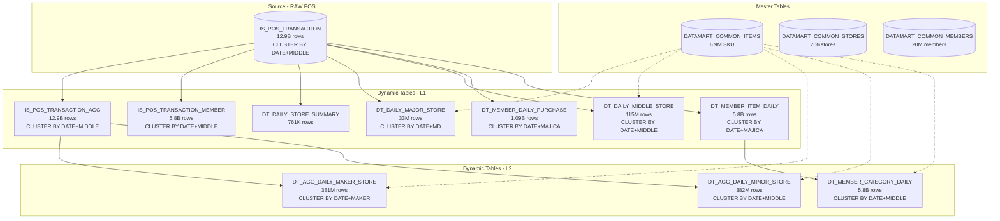

# DataCompass Pro - データサマリ

## 概要

本ドキュメントは DataCompass Pro で使用している Snowflake テーブル群のデータ概要をまとめたものです。

- **データベース**: `PPIH_FULL_DB`
- **データ期間**: 2023-05-01 〜 2026-07-05 (37ヶ月 / 1,127日)
- **対象店舗数**: 706店舗（営業中687 + 閉店19）
- **対象会員数**: 2,000万人
- **対象商品数**: 694万SKU（DS 424万 + UNY 270万）
- **POSレコード数**: 約129.6億行

---

## アーキテクチャ図



---

## 1. IS_POS_TRANSACTION (POSトランザクション)

| 項目 | 値 |
|------|------|
| スキーマ | `PPIH_FULL_DB.ANALYTICS` |
| 件数 | **12,964,573,259 (約129.6億行)** |
| 期間 | 2023-05-01 〜 2026-07-05 |
| 日数 | 1,127日 |
| 店舗数 | 676（営業中店舗のみ） |
| 商品数 | 4,244,300 (DS区分のみ) |
| majica会員紐付け率 | 45% |
| クラスタリングキー | `LINEAR(BUSINESS_DATE, MIDDLE_CODE)` |

### カラム構成

| カラム | 型 | 説明 |
|--------|------|------|
| BUSINESS_DATE | DATE | 営業日 |
| STORE_CODE | VARCHAR | 店舗コード |
| TRADE_KEY | VARCHAR | レシートキー |
| MAJICA_NO | VARCHAR | 会員番号 (NULL = 非会員) |
| ITEM_CODE | VARCHAR | JANコード |
| ITEM_SALES_QUANTITY | NUMBER | 売上数量（正規分布的ばらつき、平均~2個） |
| ITEM_SALES_AMOUNT | NUMBER | 売上金額（商品ごと固定単価 × 数量） |
| TRADE_CLASS_3 | VARCHAR | 取引区分 |
| MIDDLE_CODE | VARCHAR | 中分類コード（非正規化列） |

### 単価設定ロジック

商品ごとに固定単価（ITEM_CODEのHASHで決定）。MD別の価格帯：

| MD | 価格帯 |
|----|--------|
| 6 フード&リカー | 80〜480円 |
| 7 フレッシュフード | 100〜700円 |
| 3 ライフ＆ペット | 150〜950円 |
| 5 トレンド&コスメ | 200〜3,200円 |
| 2 ホーム&レジャー | 200〜4,200円 |
| 4 ファッション&ブランド | 300〜5,300円 |
| 1 デジタル&バラエティ | 500〜8,500円 |

---

## 2. DATAMART_COMMON_ITEMS (商品マスタ)

| 項目 | 値 |
|------|------|
| スキーマ | `PPIH_FULL_DB.MASTER` |
| 件数 | **6,944,300行** |
| 区分カラム | `ITEM_CATEGORY_CLASS` (DS / UNY) |

### カテゴリ区分別 概要

| 区分 | 商品数 | 割合 |
|------|---:|---:|
| DS (ドン・キホーテ) | 4,244,300 | 61.1% |
| UNY (ユニー) | 2,700,000 | 38.9% |
| **合計** | **6,944,300** | **100%** |

### DS区分 — MD (事業部) 別の階層内訳

| MDコード | MD名 | 大分類数 | SKU数 |
|----------|------|---------|-------|
| 1 | デジタル&バラエティ | 7 | 610,285 |
| 2 | ホーム&レジャー | 10 | 640,418 |
| 3 | ライフ＆ペット | 3 | 206,347 |
| 4 | ファッション&ブランド | 12 | 2,051,389 |
| 5 | トレンド&コスメ | 5 | 211,135 |
| 6 | フード&リカー | 4 | 374,443 |
| 7 | フレッシュフード | 4 | 133,594 |
| 8 | その他 | 11 | 7,946 |
| 9 | コンセ | 3 | 8,743 |

### 和洋日配（大分類02 デイリー内）

中分類以下をExcel実績に基づき忠実に再現：
- **0201 洋日配**: 25,192 SKU / 26サブカテゴリ（バター、チーズ、ヨーグルト等）
- **0202 和日配**: 35,496 SKU / 44サブカテゴリ（うどん、ラーメン、豆腐等）
- **0299 デイリーその他**: 54,494 SKU

### 主要カラム

| カラム | 説明 |
|--------|------|
| ITEM_CODE | JANコード (PK) |
| ITEM_NAME | 商品名 |
| ITEM_CATEGORY_CLASS | カテゴリ区分 (DS / UNY) |
| MD_CODE / MD_NAME | 事業部 |
| MAJOR_CODE / MAJOR_NAME | 大分類 |
| MIDDLE_CODE / MIDDLE_NAME | 中分類 |
| MINOR_CODE / MINOR_NAME | 小分類 |
| SUB_CODE / SUB_NAME | 細分類 |
| BRAND_CODE / BRAND_NAME | ブランド |
| MAKER_CODE / MAKER_NAME | メーカー |

---

## 3. DATAMART_COMMON_STORES (店舗マスタ)

| 項目 | 値 |
|------|------|
| スキーマ | `PPIH_FULL_DB.MASTER` |
| 件数 | **706行** |
| 法人数 | 2 |
| 営業中 | 687 |
| 閉店 | 19 |

### 法人別 店舗数

| 法人 | 合計 | 営業中 | 閉店 |
|------|---:|---:|---:|
| 株式会社ドン・キホーテ | 521 | 502 | 19 |
| ユニー株式会社 | 185 | 185 | 0 |

### 業態別 店舗数

| 業態 | 店舗数 | 法人 |
|------|---:|------|
| ドン・キホーテ | ~301 | ドン・キホーテ |
| MEGAドン・キホーテ | ~146 | ドン・キホーテ |
| ドン・キホーテUNY | 62 | ユニー |
| アピタ・ピアゴ | 123 | ユニー |
| ロビン・フッド | 5 | ドン・キホーテ |
| 小型業態ほか | ~39 | ドン・キホーテ |

### 主要カラム

| カラム | 説明 |
|--------|------|
| STORE_CODE | 店舗コード (PK) |
| STORE_NAME | 店舗名 |
| CORPORATION_CODE / NAME | 法人 |
| BUSINESS_TYPE_CODE / NAME | 業態 |
| AREA_CODE / NAME | エリア |
| PREFECTURE_CODE / NAME | 都道府県 |
| OPENING_DATE | 開店日 |
| CLOSING_DATE | 閉店日 (NULLなら営業中) |

---

## 4. DATAMART_COMMON_MEMBERS (会員マスタ)

| 項目 | 値 |
|------|------|
| スキーマ | `PPIH_FULL_DB.MASTER` |
| 件数 | **20,000,000行 (2,000万人)** |
| 性別区分 | 2 |
| 年代区分 | 7 |
| 会員ランク区分 | 6 |

---

## 5. Dynamic Tables (事前集計テーブル)

全DTに `CLUSTER BY` を設定し、パーティションプルーニングによる高速クエリを実現。

### L1: IS_POS_TRANSACTIONから直接派生

| DT名 | 件数 | クラスタリングキー | 集計粒度 | WH |
|-------|---:|---|---|---|
| IS_POS_TRANSACTION_AGG | 12.9B | `LINEAR(DATE, MIDDLE)` | 日×店×商品×中分類 | 6XL |
| IS_POS_TRANSACTION_MEMBER | 5.8B | `LINEAR(DATE, MIDDLE)` | 会員POSのみ | 6XL |
| DT_DAILY_STORE_SUMMARY | 762K | なし | 日×店 | 6XL |
| DT_DAILY_MAJOR_STORE | 33M | `LINEAR(DATE, MD)` | 日×店×大分類 | 6XL |
| DT_DAILY_MIDDLE_STORE | 115M | `LINEAR(DATE, MIDDLE)` | 日×店×中分類 | 6XL |
| DT_MEMBER_DAILY_PURCHASE | 1.09B | `LINEAR(DATE, MAJICA)` | 会員×日×店 | 6XL |
| DT_MEMBER_ITEM_DAILY | 5.8B | `LINEAR(DATE, MAJICA)` | 会員×商品×日×店 | 6XL |

### L2: DTから派生

| DT名 | 件数 | クラスタリングキー | ソース | 集計粒度 |
|-------|---:|---|---|---|
| DT_AGG_DAILY_MAKER_STORE | 381M | `LINEAR(DATE, MAKER)` | AGG | 日×店×メーカー |
| DT_AGG_DAILY_MINOR_STORE | 382M | `LINEAR(DATE, MIDDLE)` | AGG | 日×店×小分類 |
| DT_MEMBER_CATEGORY_DAILY | 5.8B | `LINEAR(DATE, MIDDLE)` | MEMBER_ITEM | 会員×日×店×中分類 |

### DT依存ツリー

```
IS_POS_TRANSACTION (RAW 129.6億, CLUSTER BY DATE+MIDDLE)
├── IS_POS_TRANSACTION_AGG (DT, lag=1day)
│   ├── DT_AGG_DAILY_MAKER_STORE (DT, lag=1day)
│   └── DT_AGG_DAILY_MINOR_STORE (DT, lag=1day)
├── IS_POS_TRANSACTION_MEMBER (DT, lag=1day)
├── DT_DAILY_STORE_SUMMARY (DT, lag=1hour)
├── DT_DAILY_MAJOR_STORE (DT, lag=1hour)
├── DT_DAILY_MIDDLE_STORE (DT, lag=1hour)
├── DT_MEMBER_DAILY_PURCHASE (DT, lag=1hour)
└── DT_MEMBER_ITEM_DAILY (DT, lag=1day)
    └── DT_MEMBER_CATEGORY_DAILY (DT, lag=1day)
```

---

## 6. DTルーティングロジック

アプリ側 (`lib/queries.ts`) では、ユーザーの分析条件に応じて最適なテーブルを自動選択：

| 集計単位 | 使用テーブル | 想定レスポンス |
|----------|-------------|--------------|
| store / area / business_type | DT_DAILY_STORE_SUMMARY | ~1秒 |
| md / major | DT_DAILY_MAJOR_STORE | ~1秒 |
| middle | DT_DAILY_MIDDLE_STORE | ~3秒 |
| minor | DT_AGG_DAILY_MINOR_STORE | ~5秒 |
| maker | DT_AGG_DAILY_MAKER_STORE | ~3秒 |
| item | IS_POS_TRANSACTION_AGG | ~10秒 |
| 会員フィルタあり | IS_POS_TRANSACTION直接 | ~10-30秒 |

---

## 7. ウェアハウス構成

| ウェアハウス | サイズ | 用途 | auto_suspend |
|---|---|---|---|
| PPIH_WH_6XL | 6X-Large | DT初期化・大規模処理 | 60秒 |
| PPIH_WH_XL | 4X-Large | DT定期リフレッシュ | 120秒 |
| DATACOMPASS_WH | Large | アプリクエリ (QAS有効) | 60秒 |

---

## 8. データソース

本データは以下のExcel資料に基づいて生成：

| シート名 | 用途 |
|---------|------|
| 商品マスタ件数_全体GP別 | DS商品マスタのMD/大分類/SKU数 |
| 日別売上DM件数_和洋日配 | 和洋日配の中分類以下の構造とレコード数 |
| journal件数_全体GP別 | POSの大分類別レコード数 |
| 業態別店舗数（画像） | 店舗マスタの業態構成 |
